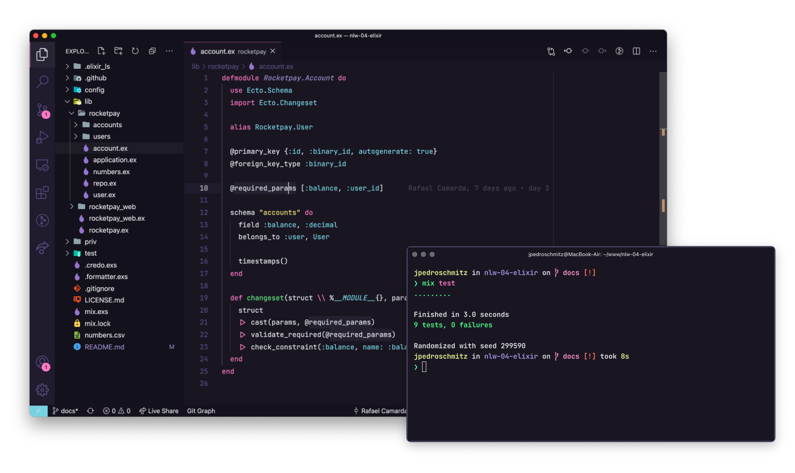

<h1 align="center">Rocketpay</h1>

  <a href="#-tecnologias">Tecnologias</a>&nbsp;&nbsp;&nbsp;|&nbsp;&nbsp;&nbsp;
  <a href="#-projeto">Projeto</a>&nbsp;&nbsp;&nbsp;|&nbsp;&nbsp;&nbsp;
  <a href="#-como-executar">Como executar</a>&nbsp;&nbsp;&nbsp;|&nbsp;&nbsp;&nbsp;
  <a href="#-saiba-mais">Saiba mais</a>&nbsp;&nbsp;&nbsp;|&nbsp;&nbsp;&nbsp;
  <a href="#-licença">Licença</a>

  
  
  
  
  
  

---

## ✨ Tecnologias

Esse projeto foi desenvolvido com as seguintes tecnologias:

- [Elixir](https://github.com/elixir-lang/elixir)
- [Phoenix](https://github.com/phoenixframework/phoenix)
- [Ecto](https://github.com/elixir-ecto/ecto)
- [ExUnit](https://github.com/elixir-lang/elixir/blob/master/lib/ex_unit/lib/ex_unit.ex)

---

## 💻 Projeto

O Rocketpay é uma aplicação que simula uma API de pagamentos entre usuários, sendo possível realizar depósitos, saques e transferências.

## 🚀 Como executar

---

Para iniciar o seu servidor Phoenix:

- Instale as dependências com `mix deps.get`
- Crie o banco de dados e rode as migrations rodando `mix ecto.setup`
- Inicie o servidor Phoenix com `mix phx.server`

Agora você pode acessar [`localhost:4000`](http://localhost:4000) do seu navegador.

Pronto para colocar em produção? Dá uma olhada nos [guias de deploy](https://hexdocs.pm/phoenix/deployment.html).

---

## ⚡️ Saiba mais

- Website oficial: [https://www.phoenixframework.org](https://www.phoenixframework.org/)
- Guias: [https://hexdocs.pm/phoenix/overview.html](https://hexdocs.pm/phoenix/overview.html)
- Documentação: [https://hexdocs.pm/phoenix](https://hexdocs.pm/phoenix)
- Fórum: [https://elixirforum.com/c/phoenix-forum](https://elixirforum.com/c/phoenix-forum)
- GitHub: [https://github.com/phoenixframework/phoenix](https://github.com/phoenixframework/phoenix)
  
---

## 📄 Licença

Esse projeto está sob a licença MIT. Veja o arquivo [LICENSE](LICENSE.md) para mais detalhes.

---

Made with 💜💚💙[by Israel Silva](https://israel206.github.io/) 👋 copyrighted Rocketseat

[ts]: https://www.typescriptlang.org
[vscode]: https://code.visualstudio.com/
[yarn]: https://yarnpkg.com/
[vceditconfig]: https://marketplace.visualstudio.com/items?itemName=EditorConfig.EditorConfig
[vceslint]: https://marketplace.visualstudio.com/items?itemName=dbaeumer.vscode-eslint
